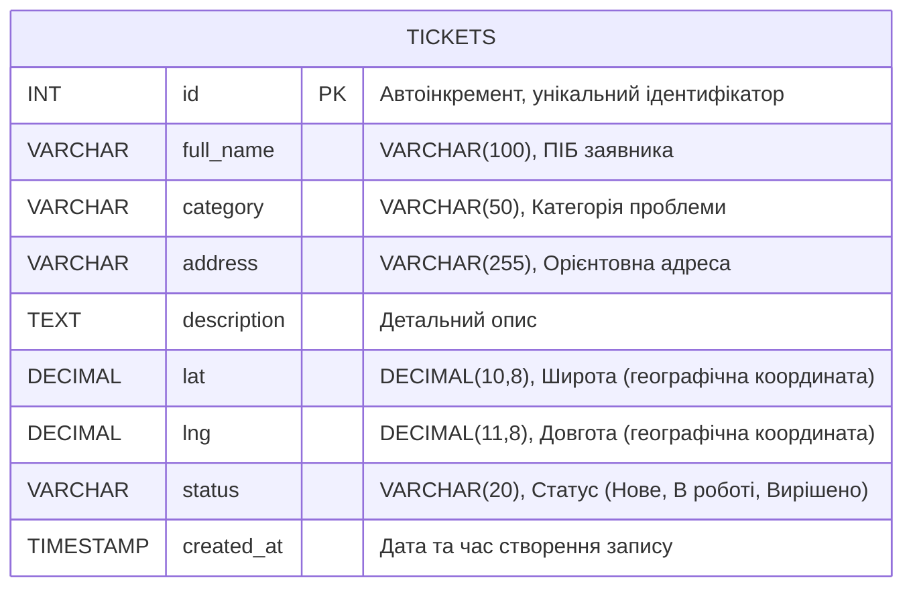

# Схема бази даних (ER-діаграма)

## Графічна модель

```mermaid
erDiagram
    TICKETS {
        INT id PK "Автоінкремент, унікальний ідентифікатор"
        VARCHAR full_name "VARCHAR(100), ПІБ заявника"
        VARCHAR category "VARCHAR(50), Категорія проблеми"
        VARCHAR address "VARCHAR(255), Орієнтовна адреса"
        TEXT description "Детальний опис"
        DECIMAL lat "DECIMAL(10,8), Широта (географічна координата)"
        DECIMAL lng "DECIMAL(11,8), Довгота (географічна координата)"
        VARCHAR status "VARCHAR(20), Статус (Нове, В роботі, Вирішено)"
        TIMESTAMP created_at "Дата та час створення запису"
    }
```